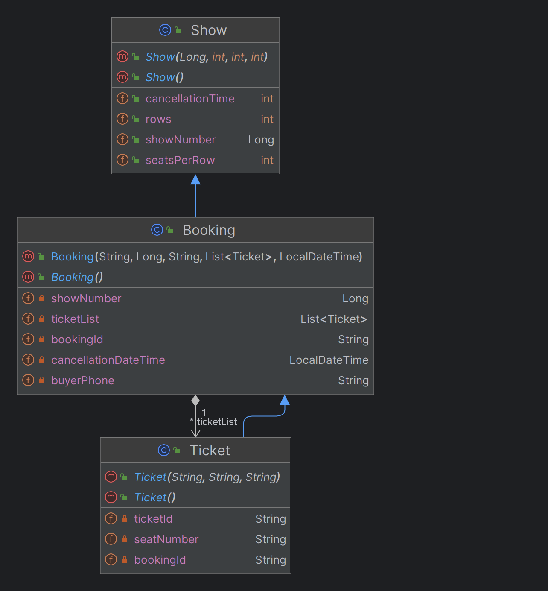

## Show Booking System

### Use Case

• Build a simple Java application for the use case of booking a Show. The program must take input from command line.  
• The program should setup available seats per show, allow buyers to select 1 or more available seats and buy/cancel
tickets.  
• The application shall cater to the below 2 types of users & their requirements – (1) Admin and (2) Buyer

&rarr; Admin – The users should be able to set up and view the list of shows and seat allocations.
Commands to be implemented for Admin :

1. `Setup  <Show Number> <Number of Rows> <Number of seats per row>  <Cancellation window in minutes>`   
   (To set up the number of seats per show)
2. `View <Show Number>`  
   (To display Show Number, Ticket#, Buyer Phone#, Seat Numbers allocated to the buyer)

&rarr; Buyer – The users should be able to retrieve list of available seats for a show, select 1 or more seats , buy and
cancel tickets.  
Commands to be implemented for Buyer :

1. `Availability  <Show Number> `   
   (To list all available seat numbers for a show. E,g A1, F4 etc)
2. `Book  <Show Number> <Phone#> <Comma separated list of seats>  `  
   (To book a ticket. This must generate a unique ticket # and display)
3. `Cancel  <Ticket#>  <Phone#>`  
   (To cancel a ticket. See constraints in the section below)

### Constraints:

• Assume max seats per row is 10 and max rows are 26. Example seat number A1, H5 etc. The “Add” command for admin must
ensure rows cannot be added beyond the upper limit of 26.  
• After booking, User can cancel the seats within a time window of 2 minutes (configurable). Cancellation after that is
not allowed.  
• Only one booking per phone# is allowed per show.

### Requirements:

1. Implement the solution as Java standalone application (Java 8+). Can be Springboot as well. The data shall be
   in-memory.
2. Write appropriate Unit Tests.
3. Implement the above use case considering object-oriented principles and development best practices. The
   implementation should be a tested working executable.
4. The project code to be uploaded to GitHub and share back to us for offline review by 31 March 2023
5. Just make an assumption if anything is not mentioned here. The same can be highlighted in the readme notes when
   submitting.

### Assumptions:

1. No authentication needed for both roles.
2. Assume phone numbers are made up of 8 digits, only numbers and no other characters.
3. If a booking has no other tickets, it will be deleted as well.

### Future improvements:

1. If there are no more seats available for booking, will disable the buyer from selecting it when buying

### Quality of Life Improvements:

I made it more user-friendly by:

1. Requesting and validating each field one by one and showing the error encountered.
2. Showing the list of bookings and tickets before cancelling to ease the process
3. Showing seat maps before booking to refresh the buyer's memory

### Class Diagram:

